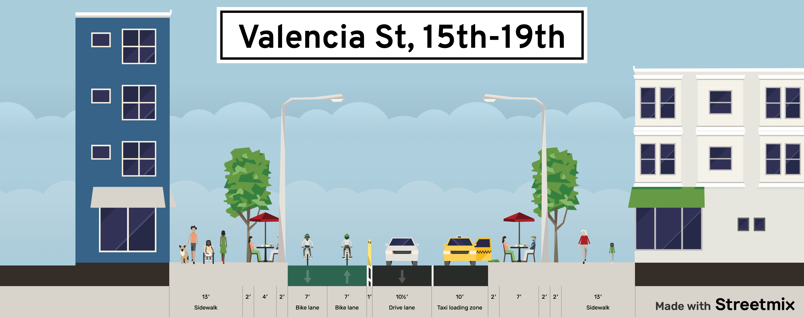

# Valencia Bikeway

Behold a modest proposal to add a two-way protected cycletrack on the east side of Valencia St and converting the other lane to alternating one-way traffic, with lots of commercial and 10-minute loading zones as well as accessible blue-zone parking alongside parklets.

https://burritojustice.github.io/valencia_bikeway/#18/37.75774/-122.42144

https://streetmix.net/burritojustice/6/valencia-st-15th-19th

Also shows bus lanes - 55 (15th), 27 (24th to CC), 12 (26th to CC) and SFPD access along 18th.

Not totally sure yet what traffic would looks like north of 14th and south of 24th.

## Sources

tangram.js, pixel, curblines from DataSF

https://data.sfgov.org/City-Infrastructure/City-curbs-and-islands/4s5e-m4gv

[Shared Spaces GeoJSON](https://services.arcgis.com/Zs2aNLFN00jrS4gG/arcgis/rest/services/shared_spaces_data/FeatureServer/0/query?f=geojson&where=1%3D1&returnGeometry=true&spatialRel=esriSpatialRelIntersects&outFields=*&maxRecordCountFactor=4&outSR=4326&resultOffset=0&resultRecordCount=8000&cacheHint=true&quantizationParameters=%7B%22mode%22%3A%22view%22%2C%22originPosition%22%3A%22upperLeft%22%2C%22tolerance%22%3A1.0583354500041853%2C%22extent%22%3A%7B%22xmin%22%3A-13638852.978948362%2C%22ymin%22%3A-1436598.6699333906%2C%22xmax%22%3A-8621695.126715293%2C%22ymax%22%3A5983364.401551564%2C%22spatialReference%22%3A%7B%22wkid%22%3A4326%2C%22latestWkid%22%3A4326%7D%7D%7D) (reformatted to 4326)
