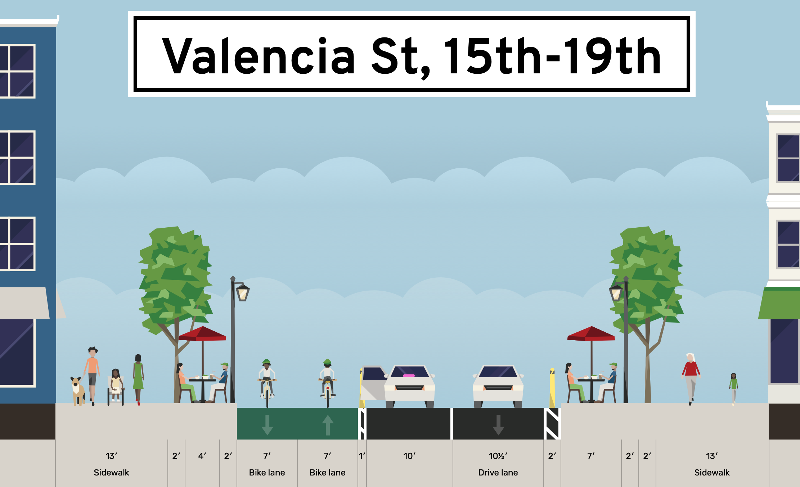

# Valencia Street Bikeway

Behold a modest proposal to add a two-way protected cycletrack on the east side of Valencia St and converting the west lane to alternating one-way traffic, with lots of 10-minute loading zones for food pickup and commercial delivery, as well as accessible blue-zone parking alongside lots of parklets and more human-friendly space.

Valencia St is a geometry problem. Rideshare, commercial loading, and food pickup/delivey aren't going away, and neither are parklets or cyclists. While I'd love Valencia to be a car-free pedestrian promenade, that's not going to happen any time soon. But reallocating one lane of car traffic for bikes, making more room for parklets, and making it easier for commercial traffic? Anyone can still drive on Valencia, just not all the way. Everyone gets something, and everyone is safer. 

https://streetmix.net/burritojustice/6/valencia-st-15th-19th

Zoomable map: marching ants indicate direction of travel. There are increasing levels of road detail and parklets visible as you zoom in.

https://burritojustice.github.io/valencia_bikeway/#18/37.75774/-122.42144

## Assumptions and Questions:

- You could flip this alternating one-way pattern for each block, hard to say which is optimal.
- Extra space in the orange parklet zone not actually used by parklets would be more space for pedestians.
- I'd go as suggest no westbound turns off of Valencia, but if you do, you'd obviously have protected intersections.
- 14th to 19th is the narrowest part of Valencia, and raises some of the biggest question on how to allocate space for commercial access after a two-way cyclepath and parklets are in place.
- What does traffic looks like north of 14th and south of 24th? The streets are wide enough to have two way traffic and a protected two-way cyclepath.
- Assuming loading islands for school drop-off at Synergy and Buena Vista-Horace Mann. These could be used for general parking outside of school loading hours as is done along 14th. 
- Muni has a few lines to consider -- 27 (24th to CC), 12 (26th to CC), 55 (16th-15th, which interferes with the pattern -- but I believe is non-revenue so maybe it turns on Guerrero?). There's also need for counterflow SFPD access along 18th.
- Privately owned cars could park in the commmercial loading zone overnight. Would also need blue zone / accessible parking spots.

## Sources

tangram.js, Tilezen, 2019 curblines from [data.sf.gov](https://data.sfgov.org/City-Infrastructure/City-curbs-and-islands/4s5e-m4gv). 

https://data.sfgov.org/City-Infrastructure/City-curbs-and-islands/4s5e-m4gv

There is no raw data available for Shared Spaces on data.sfgov.org, just a published map, but I liberated it for the purpose of this exercise.

[Shared Spaces GeoJSON](https://services.arcgis.com/Zs2aNLFN00jrS4gG/arcgis/rest/services/shared_spaces_data/FeatureServer/0/query?f=geojson&where=1%3D1&returnGeometry=true&spatialRel=esriSpatialRelIntersects&outFields=*&maxRecordCountFactor=4&outSR=4326&resultOffset=0&resultRecordCount=8000&cacheHint=true&quantizationParameters=%7B%22mode%22%3A%22view%22%2C%22originPosition%22%3A%22upperLeft%22%2C%22tolerance%22%3A1.0583354500041853%2C%22extent%22%3A%7B%22xmin%22%3A-13638852.978948362%2C%22ymin%22%3A-1436598.6699333906%2C%22xmax%22%3A-8621695.126715293%2C%22ymax%22%3A5983364.401551564%2C%22spatialReference%22%3A%7B%22wkid%22%3A4326%2C%22latestWkid%22%3A4326%7D%7D%7D) (reformatted to 4326)
